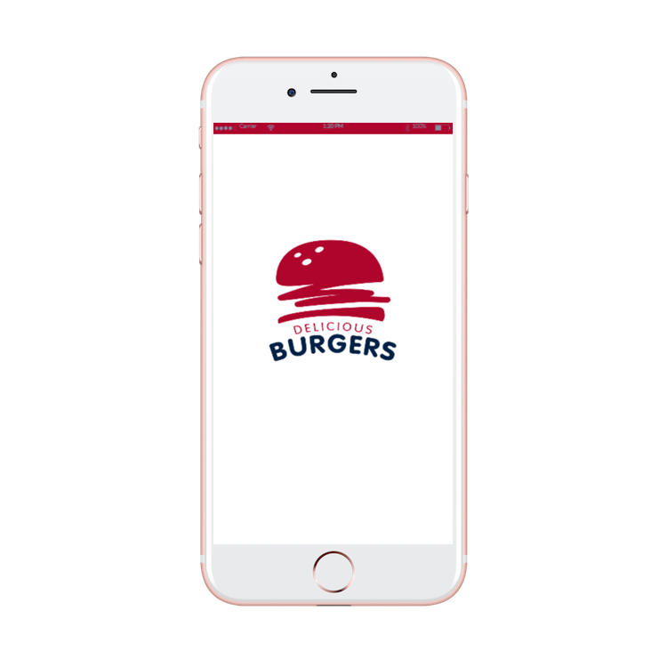

<!DOCTYPE html>
<html>
<head>
	<meta name="viewport" content="width=device-width, initial-scale=1">
	<link rel="stylesheet" href="https://maxcdn.bootstrapcdn.com/bootstrap/3.4.0/css/bootstrap.min.css">
  
  
  
</head>
<body>
<h1>Reserve&Eat</h1>
<blockquote>
    
This application is a project for a thesis, a student of <i>Krakow University of Economics (UEK)</i>. The application implements the functions of reserving a table in a cafe, when using technology <i>QRcode</i>. At the moment the project is at the implementation stage.

    <footer><i>Denis Kutsenko</i></footer>
  </blockquote>
<a href="https://den575.github.io/">Web page</a>

    

          65% Complete
      

    

</body>
</html>