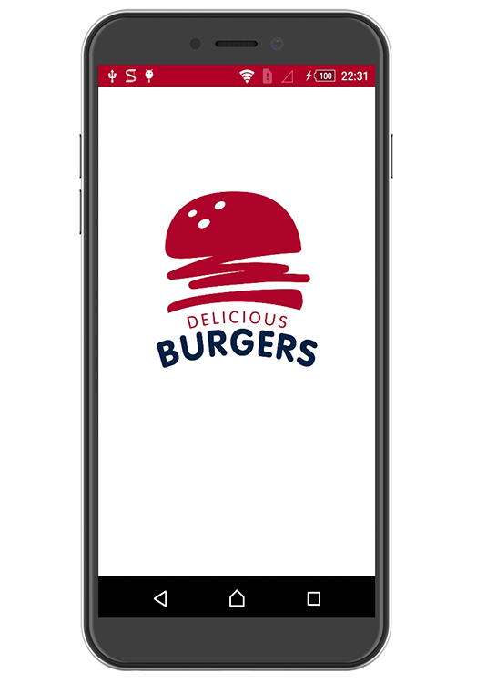

<!DOCTYPE html>
<html>
<head>
</head>
<body>
<h1>Reserve&Eat</h1>
<blockquote>
    
This application is a project for a thesis, a student of <i>Krakow University of Economics (UEK)</i>. The application implements the functions of reserving a table in a cafe, when using technology <i>QRcode</i>. At the moment the project is at the implementation stage.

    <footer><i>Denis Kutsenko</i></footer>
  </blockquote>
<a href="https://den575.github.io/">Web page</a>

</body>
</html>